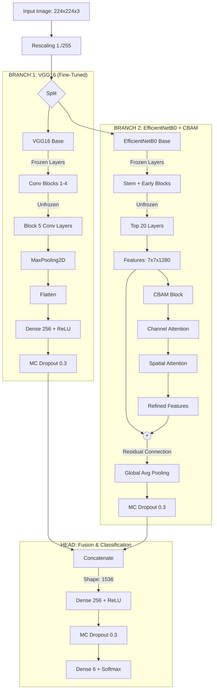

# Hybrid-CNN-VGG16-EfficientNetB0-dengan-CBAM
 
 
 

## **Arsitektur Hybrid CNN: VGG16 + EfficientNetB0 dengan Residual CBAM**
**Berdasarkan Implementasi Code & Paper**

Rani R, Bharany S, Elkamchouchi DH, Ur Rehman A, Singh R, Hussen S. VGG-EffAttnNet: Hybrid Deep Learning Model for Automated Chili Plant Disease Classification Using VGG16 and EfficientNetB0 With Attention Mechanism. Food Sci Nutr. 2025 Jul 24;13(7):e70653.

**Dataset** : Chili Plant Leaf Disease and Growth Stage Dataset from Bangladesh
 https://data.mendeley.com/datasets/w9mr3vf56s/1

### **Diagram Arsitektur**



### **Detail Implementasi Arsitektur Hybrid**

#### **Input Processing**
- **Dimensi Input**: 224×224×3 (RGB)
- **Preprocessing**: 
  - `Rescaling`: Normalisasi nilai piksel sederhana (1./255) menggunakan `ImageDataGenerator`.

#### **Dual-Branch Feature Extraction**

**Branch 1 - VGG16 Pathway (Stability Focus):**
- **Base Model**: VGG16 (ImageNet Weights).
- **Fine-Tuning Strategy**: 
  - Layer awal dibekukan (Frozen).
  - **4 Layer Terakhir** di-unfreeze untuk melatih fitur spesifik penyakit cabai.
- **Flow**:
  ```
  Input → VGG16 Base → (7,7,512) → Flatten → Dense(256) → MC Dropout(0.3)
  ```

**Branch 2 - EfficientNetB0 + Residual CBAM (Detail Focus):**
- **Base Model**: EfficientNetB0 (ImageNet Weights).
- **Fine-Tuning Strategy**:
  - Layer awal dibekukan.
  - **20 Layer Terakhir** di-unfreeze.
- **Attention Mechanism**: 
  - Menggunakan modul CBAM (Convolutional Block Attention Module) kustom.
  - **Residual Connection**: Output asli EfficientNet ditambahkan (+) dengan output CBAM untuk mencegah degradasi gradien.
- **Flow**:
  ```
  Input → EfficientNet Base → (7,7,1280) → [CBAM + Residual] → GAP → MC Dropout(0.3)
  ```

#### **CBAM Block Configuration**
Implementasi sesuai fungsi `cbam_block(x)` pada kode:
1.  **Channel Attention**:
    - Menggunakan *Shared MLP* dengan `ratio=8`.
    - Menggabungkan `GlobalAvgPool` dan `GlobalMaxPool`.
    - Activation: Sigmoid.
2.  **Spatial Attention**:
    - Menggabungkan `Mean` dan `Max` pooling sepanjang axis channel.
    - Menggunakan `Conv2D` dengan kernel **7x7**.
    - Activation: Sigmoid.

#### **Feature Fusion & Output**
Penggabungan fitur dilakukan dengan metode *Late Fusion* (Concatenation) dari kedua branch yang telah melalui proses dropout.

```
[VGG Feature (256)] ⊕ [EfficientNet Feature (1280)] 
          ↓
Concatenate Layer (Total: 1536 features)
          ↓
Dense(256, Activation='relu')
          ↓
MC Dropout (Rate 0.3)
          ↓
Output Layer (Dense 6, Activation='softmax')
```

### **Spesifikasi Teknis Berdasarkan Model Summary**

#### **Dimensional Flow**
```
Input Image: (224, 224, 3)
    ↓
├── VGG16 Path:
│   └── Output Tensor: (None, 256)
│       (Dari Flatten → Dense 256)
│
├── EfficientNetB0 Path:
│   ├── Base Output: (None, 7, 7, 1280)
│   ├── CBAM Process: (None, 7, 7, 1280)
│   └── GAP Output: (None, 1280)
│
└── Concatenation:
    └── (None, 256) + (None, 1280) → (None, 1536)
    
Classification Head:
    └── (None, 1536) → Dense(256) → Output(6)
```

#### **Key Implementation Details**

1.  **MC Dropout (Monte Carlo Dropout)**:
    - Menggunakan class custom `MCDropout` yang tetap aktif saat *inference* (`training=True`).
    - Memungkinkan estimasi ketidakpastian (uncertainty estimation) saat prediksi.
    - Rate: 0.3 di semua layer dropout.

2.  **Residual Learning pada Attention**:
    - Berbeda dengan implementasi standar, model ini menggunakan `layers.Add()` antara fitur asli EfficientNet dan fitur hasil CBAM.
    - Kode: `eff_refined = layers.Add()([eff_features, eff_attn_features])`.

3.  **Optimization**:
    - Optimizer: Adam (`learning_rate=0.0001`).
    - Loss: Categorical Crossentropy.
    - Callbacks: EarlyStopping (Patience 5) dan ModelCheckpoint (Save Best Only).

### **Keunggulan Arsitektur Code Ini**

1.  **Residual Attention**: Penambahan *skip connection* pada blok CBAM memastikan fitur asli dari EfficientNet tidak hilang jika atensi gagal mempelajari fitur yang relevan, serta mempercepat konvergensi.
2.  **Uncertainty Estimation**: Penggunaan MC Dropout memungkinkan model memberikan tingkat kepercayaan (confidence) yang lebih realistis pada data test, bukan sekadar probabilitas softmax.
3.  **Complementary Features**:
    - VGG16 menyediakan fitur tekstur dan bentuk global yang kuat (via Flatten).
    - EfficientNet menyediakan fitur detail semantik yang efisien (via GAP).
4.  **Efficient Parameter Usage**: Dengan membekukan sebagian besar layer awal (Transfer Learning), model fokus melatih layer tingkat tinggi dan modul atensi, mengurangi risiko overfitting pada dataset cabai.