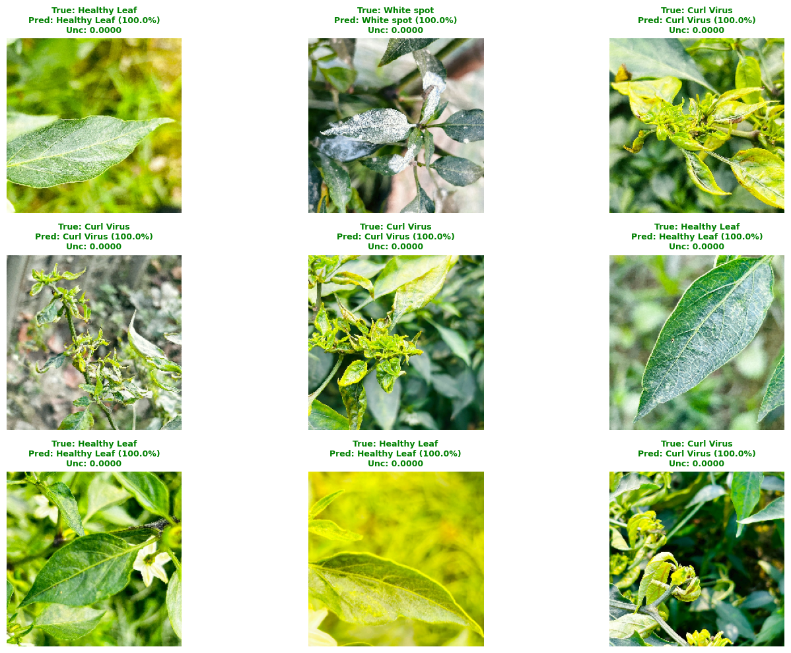
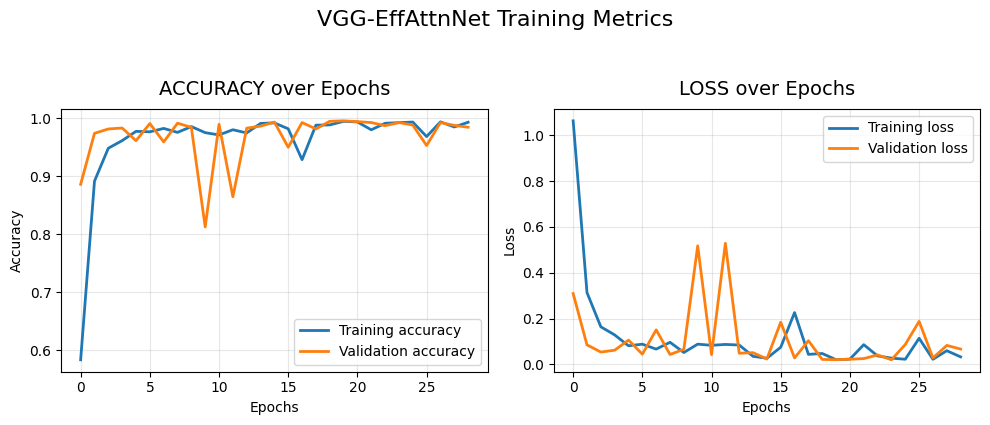
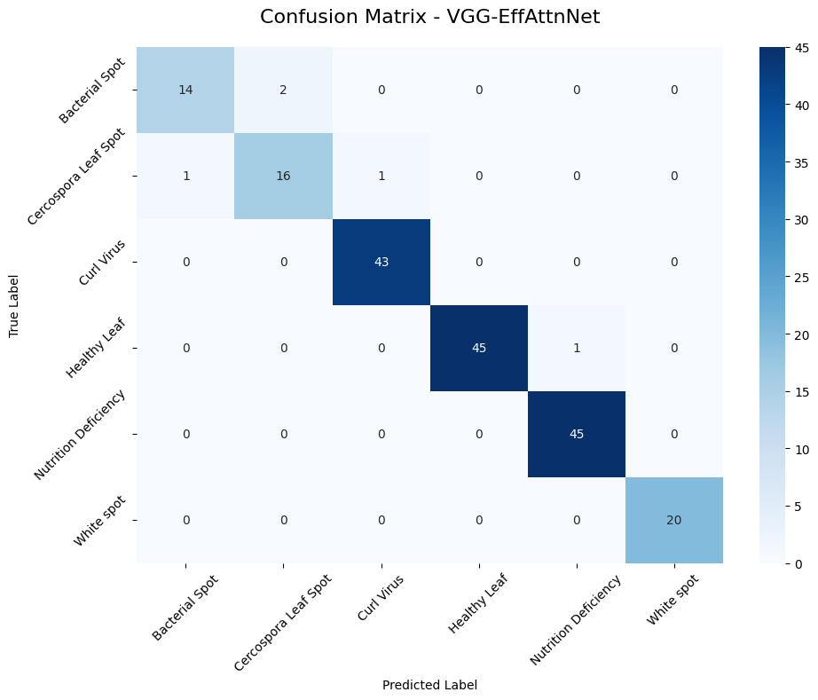
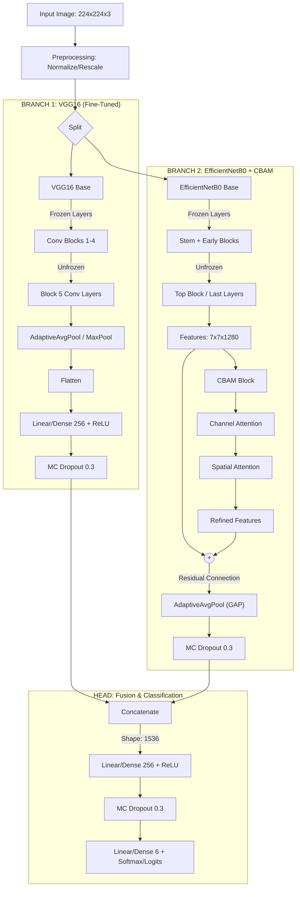
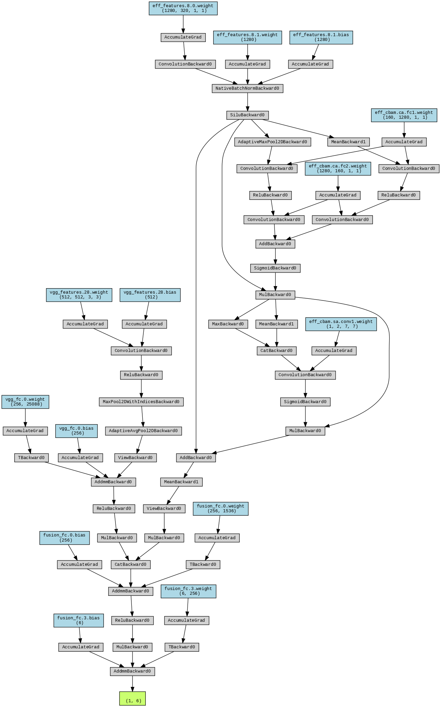

# Hybrid-CNN-VGG16-EfficientNetB0-dengan-CBAM

 
 
 

 
- [Link Model Tensorflow final_vgg_effattnnet.keras](https://1o872djuge.ufs.sh/f/hL4tjTnv9CWb1qdVYawm5SpdhJ8LGXaFcP2YIzDvusClwW1o)


- [Link Model PyTorch best_model_pytorch.pth](https://1o872djuge.ufs.sh/f/hL4tjTnv9CWbiU1NOIXNk7PnwbTSjVxe0qiHWhyMLZEJplcR)

## **Arsitektur Hybrid CNN: VGG16 + EfficientNetB0 dengan Residual CBAM**
**Berdasarkan Implementasi Code & Paper**

Rani R, Bharany S, Elkamchouchi DH, Ur Rehman A, Singh R, Hussen S. VGG-EffAttnNet: Hybrid Deep Learning Model for Automated Chili Plant Disease Classification Using VGG16 and EfficientNetB0 With Attention Mechanism. Food Sci Nutr. 2025 Jul 24;13(7):e70653.

**Dataset** : Chili Plant Leaf Disease and Growth Stage Dataset from Bangladesh
 https://data.mendeley.com/datasets/w9mr3vf56s/1

### **Diagram Arsitektur**



### **Detail Implementasi Arsitektur Hybrid**

#### **Input Processing**
- **Dimensi Input**: 224×224×3 (RGB)
- **Preprocessing**: 
  - **PyTorch**: Normalisasi ImageNet (`mean=[0.485, 0.456, 0.406]`, `std=[0.229, 0.224, 0.225]`).
  - **TensorFlow**: Rescaling standar `1./255`.

#### **Dual-Branch Feature Extraction**

**Branch 1 - VGG16 Pathway (Stability Focus):**
- **Base Model**: VGG16 (ImageNet Weights).
- **Fine-Tuning Strategy**: 
  - Layer awal dibekukan (Frozen).
  - **4 Layer Konvolusi Terakhir** di-unfreeze untuk melatih fitur spesifik.
- **Flow**:
  ```
  Input → VGG16 Features → AdaptiveAvgPool(7x7) → Flatten → Linear(256) → MC Dropout(0.3)
  ```

**Branch 2 - EfficientNetB0 + Residual CBAM (Detail Focus):**
- **Base Model**: EfficientNetB0 (ImageNet Weights).
- **Fine-Tuning Strategy**:
  - Layer awal dibekukan.
  - **Blok Terakhir (Top Block)** di-unfreeze.
- **Attention Mechanism**: 
  - Menggunakan modul CBAM (Convolutional Block Attention Module).
  - **Residual Connection**: Output asli EfficientNet ditambahkan (+) dengan output CBAM untuk mencegah degradasi gradien.
- **Flow**:
  ```
  Input → EfficientNet Features → (7,7,1280) → [CBAM + Residual] → GAP → Flatten → MC Dropout(0.3)
  ```

#### **CBAM Block Configuration**
Implementasi modul atensi kustom:
1.  **Channel Attention**:
    - Menggabungkan `AvgPool` dan `MaxPool` (Global).
    - Shared MLP dengan `ratio=8`.
    - Activation: Sigmoid.
2.  **Spatial Attention**:
    - Menggabungkan `Mean` dan `Max` pooling sepanjang axis channel.
    - Menggunakan Konvolusi kernel **7x7**.
    - Activation: Sigmoid.

#### **Feature Fusion & Output**
Penggabungan fitur dilakukan dengan metode *Late Fusion* (Concatenation).

```
[VGG Feature (256)] ⊕ [EfficientNet Feature (1280)] 
          ↓
Concatenate Layer (Total: 1536 features)
          ↓
Linear/Dense(256, Activation='relu')
          ↓
MC Dropout (Rate 0.3)
          ↓
Output Layer (Linear/Dense 6)
```

### **Spesifikasi Teknis**

#### **Dimensional Flow**
```
Input Image: (Batch, 3, 224, 224)
    ↓
├── VGG16 Path:
│   └── Output Tensor: (Batch, 256)
│       (Flatten dari 512*7*7 → Linear 256)
│
├── EfficientNetB0 Path:
│   ├── Base Output: (Batch, 1280, 7, 7)
│   ├── CBAM Process: (Batch, 1280, 7, 7)
│   └── GAP + Flatten: (Batch, 1280)
│
└── Concatenation:
    └── (Batch, 256) + (Batch, 1280) → (Batch, 1536)
    
Classification Head:
    └── (Batch, 1536) → Linear(256) → Output(6)
```

#### **Key Implementation Details**

1.  **MC Dropout (Monte Carlo Dropout)**:
    - Menggunakan class custom `MCDropout`.
    - Dropout tetap aktif saat evaluasi/testing (`training=True`/`train()`) untuk estimasi ketidakpastian.
    - Rate: 0.3.

2.  **Residual Learning pada Attention**:
    - Fitur asli ditambahkan kembali ke fitur hasil atensi: `x + attention(x)`.

3.  **Optimization**:
    - **Optimizer**: Adam (`lr=0.0001`).
    - **Loss Function**: CrossEntropyLoss (PyTorch) / Categorical Crossentropy (TF).
    - **Callbacks**: EarlyStopping (Patience 5) dan menyimpan model terbaik (Best Weights).

### **Keunggulan Arsitektur Ini**

1.  **Residual Attention**: Skip connection pada blok CBAM menjaga aliran informasi fitur asli dan mempercepat konvergensi.
2.  **Complementary Features**:
    - VGG16 menangkap fitur bentuk dan tekstur global.
    - EfficientNet menangkap detail semantik yang kompleks dengan efisiensi parameter.
3.  **Robustness**: Penggunaan augmentasi data (Rotation, Flip, ColorJitter) dan MC Dropout mengurangi overfitting pada dataset terbatas.

